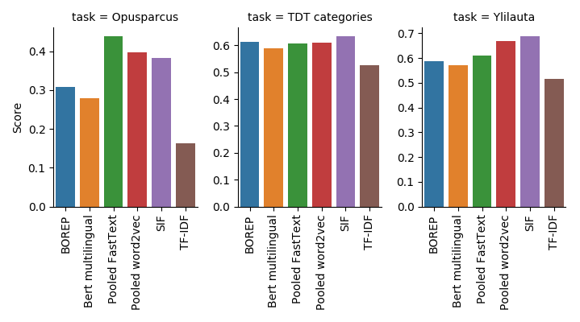

# Comparing Finnish sentence embedding methods

The purpose of this repository is to compare sentence embedding models
for Finnish and understand if the methods, which are known to perform
well on English language, are useful on Finnish, too.

[Sentence embeddings](https://en.wikipedia.org/wiki/Sentence_embedding) are
natural language processing algorithms that map textual sentences into
numerical vectors. Vectors are supposed to capture the meaning of the
sentence. The embeddings can be used to compare sentences: if two
sentences express a similar idea using different words, the
corresponding embedding vectors should still be close to each other.
Sentence embeddings are have been found to improve performance on many
NLP tasks, such as sentiment analysis and machine translation.

The training of the embedding models usually requires very large text
corpora and significant computing power. Researchers have, however,
published pre-trained models which can be adapted to various
downstream tasks with reasonable low effort. Pre-trained sentence
embeddings are typically used as input features to a neural network
(or other machine learning model). Only the task-specific model is
trained while the sentence embedding model if kept fixed.

Researchers have so far focused mostly on English and other most
spoken languages. However, there have been a few pre-trained models
published for Finnish (or rather multilingual models that include
Finnish). This analysis will compare the published Finnish models.

Models included in the comparison:
* TF-IDF
* Average-pooled [word2vec](https://en.wikipedia.org/wiki/Word2vec) trained on the [Finnish Internet Parsebank](http://bionlp.utu.fi/finnish-internet-parsebank.html)
* Average-pooled multilingual [FastText](https://github.com/facebookresearch/fastText/blob/master/docs/crawl-vectors.md)
* Multilingual [BERT](https://github.com/google-research/bert/blob/master/multilingual.md)
* [Smoothed Inverse Frequency weighting](https://openreview.net/forum?id=SyK00v5xx) (SIF) of word embeddings
* [Bag of embedding projections](https://openreview.net/forum?id=BkgPajAcY7) (BOREP)
* [LASER - Language-Agnostic SEntence Representations](https://github.com/facebookresearch/LASER)

## Download datasets and pre-trained models

```
./scripts/get_data.sh
```

## Run

```
pipenv run scripts/run.sh
```

The results are written to results/scores.{csv, png}.

## Hyperparameter optimization

```
pipenv run scripts/tune_hyperparameters.sh
```

The optimal hyperparameters are written to
results/hyperparameters.json.

To start using the tuned parameters copy the file to the models
subdirectory:
```
cp results/hyperparameters.json models/hyperparameters.json
```

## Preliminary results

The image shows performance of the models on the test sets.



The embeddings from a given model are used as an input for a shallow
neural network classifier. The classifier is trained on training data,
the pre-trained embedding models are not trained. See the source code
for the details.

(Preliminary) conclusions:
* Models based on word vectors (word2vec, FastText) perform much
  better than TF-IDF
* Simple aggregates of word vectors (average pooling, weighted average
  of SIF) seems to perform better than the more advanced BERT. This is
  in contrast to general experience in English. Maybe the BERT
  training corpus for Finnish is too small?

Caveat: The hyperparameters should be tuned more carefully. Might
affect especially the higher dimensional models (BERT, BOREP).
